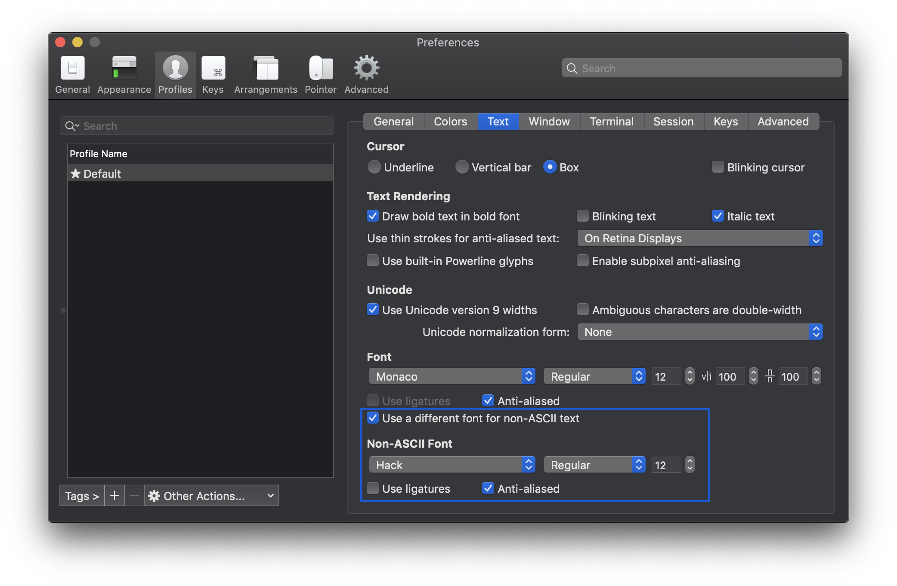
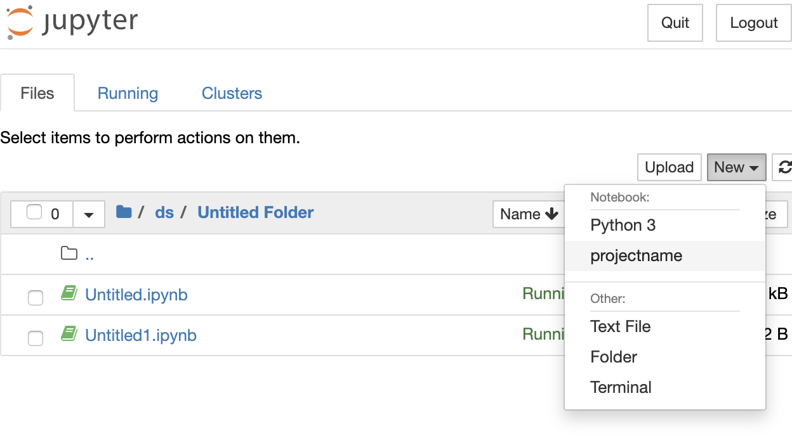

# Setup your macbook for DS

This guide covers the basics of setting up a Data Science development environment on a new Mac (python only) that I personally prefer. Installation of specific python libraries is not covered.


#### Run all
To run all in one shot you can try to run:

```bash
curl -L https://raw.githubusercontent.com/nk239/macbook-ds-setup/master/macbook-setup.sh | bash

# or 
sh -e "$(https://raw.githubusercontent.com/nk239/macbook-ds-setup/master/macbook-setup.sh)"
```

#### Get Xcode Command Line Tools
This package will install a set of handy tools required for development. It's required for example, installing python libraries. Open a Terminal and type:

```bash
xcode-select --install
```

A window will pop up, just click install and follow instructions.


#### Get Homebrew
Brew is a package manager that will help us to install and maintain applications. For example, apps like git, nmap or wget that are missing by default can be easily installed and updated. To user brew, open a terminal and type:

```bash
ruby -e "$(curl -fsSL https://raw.githubusercontent.com/Homebrew/install/master/install)"
```

#### Common Apps
There is an application inside Brew called Cask, it is meant to download and upload non-only-terminal apps (aka regular apps, like Chrome) so instead of downloading applications manually from their websites, you can do it straight away from the console. If you come from Linux world it's like APT. To check whether an application is supported by Cask, you can check online on their website.

First we need to install Cask:

```bash
brew install cask
```

To check that everything is good:

```bash
brew doctor
```

Once it's installed let's download bunch of useful apps:

```bash
brew cask install \
	sublime-text \
	sourcetree \
	slack \
	pycharm-ce \
	remote-desktop-manager \
	keka \
	macdown \
	jupyter-notebook-viewer \
	docker
```

- `sublime-text` - powerful text editor
- `sourcetree` - GUI for git 
- `slack` - messenger for teams 
- `pycharm-ce` - the most powerful python IDE
- `remote-desktop-manager` - for RDP connections
- `keka` - the macOS file archiver
- `macdown` - nice editor for markdown (ReadMe.md files)
- `jupyter-notebook-viewer` - super nice small app to view notebooks without running jupyter
- `docker` - OS-level virtualization to deliver software in packages.

#### Replacing the terminal
iTerm2 is a really nice replacement with really nice features, like mouse support, split pane views, hotkeys, paste history.

```bash
brew cask install iterm2
```

Use brew to Install Fish:

```bash
brew install fish
```

Add it to default shells:

```bash
echo "/usr/local/bin/fish" | sudo tee -a /etc/shells
```

Load the shell:

```bash
chsh -s /usr/local/bin/fish
```
 
Install OhMyFish, a plugin manager (omf install PluginName)

```bash
curl -L https://get.oh-my.fish | fish
```
 
Get a bunch of useful plugins

```bash
omf install sublime osx bobthefish pyenv
```

If you notice there are some weirds icons in the terminals and this is because by default some of the fonts are missing. In order to fix it: 

Load the Fonts repository:

```bash
brew tap caskroom/fonts   
```
 
Install Hack font:

```bash
brew cask install font-hack
```

And then just go to Iterm2 > Preferences > Profiles > Text 
and ensure "Use a different font for non-ASCII text" is ticked with 'Hack Regular' font.



Additional features for fish:

```bash
brew install tree
```

- `tree` produces nice ASCII directory tree: [see here](http://sourabhbajaj.com/mac-setup/iTerm/tree.html) - super nice for Readme file creation.


#### Get python 

Python 2.7 comes by default in macOS, but we don't want to end up messing the default system's interpreter. We strongly recommend install Python3 and [PyEnv](https://github.com/pyenv/pyenv), so we can install and remove libraries without interfering with the operative system. There is a really nice python platform ready for science called [Anaconda](https://www.anaconda.com/distribution/), it's really well supported and by default is useable, removing all the tedious work of setting up and installing tons of libraries. To install  Anaconda:

Install PyEnv:

```bash
brew install pyenv
```
 
And Get Anaconda from PyEnv:

```bash
pyenv install anaconda3-2019.03
```

SetUp anaconda as default version:

```bash
pyenv global anaconda3-2019.03
```
Now close the current terminal window and open a new one.

Get virtualenv through pip

```bash
pip install virtualenv 
```

If you get `-bash: pip: command not found` install pip first

```bash
sudo easy_install pip
```

#### Python 3 
Additional tutorial is available by [link](https://wsvincent.com/install-python3-mac/).

```bash
brew install python3
```

It’s a best practice to keep all your virtualenvs in one place, for example `.virtualenvs/` in your home directory. Let’s create that directory:

```bash
mkdir ~/.virtualenvs
python3 -m venv ~/.virtualenvs/myvenv
source ~/.virtualenvs/myvenv/bin/activate
```

Now, from inside the environment install ipykernel using pip (to use Jupyter):

```bash
pip install ipykernel
ipython kernel install --user --name=projectname
```

Then you can choose it while creating now notebook:



---
P.S. Huge credit for the creation of this instruction goes to my former colleague and just a cool DS guy Alvaro Rabadan.
